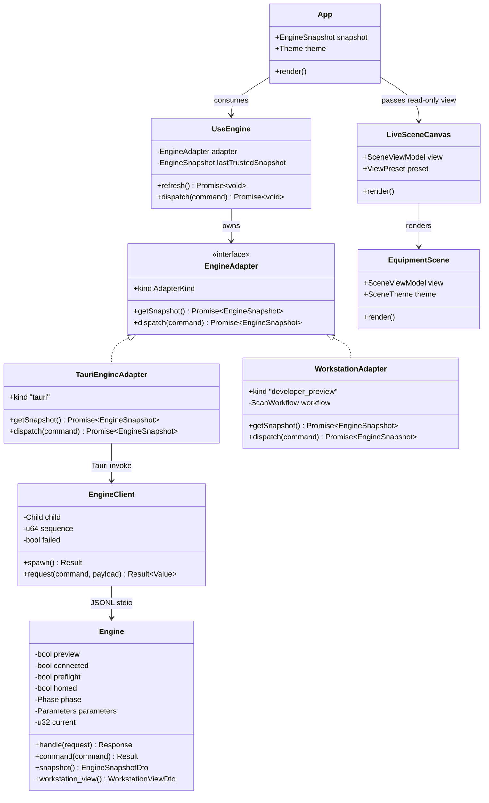
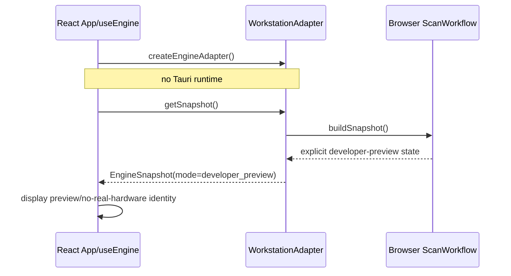
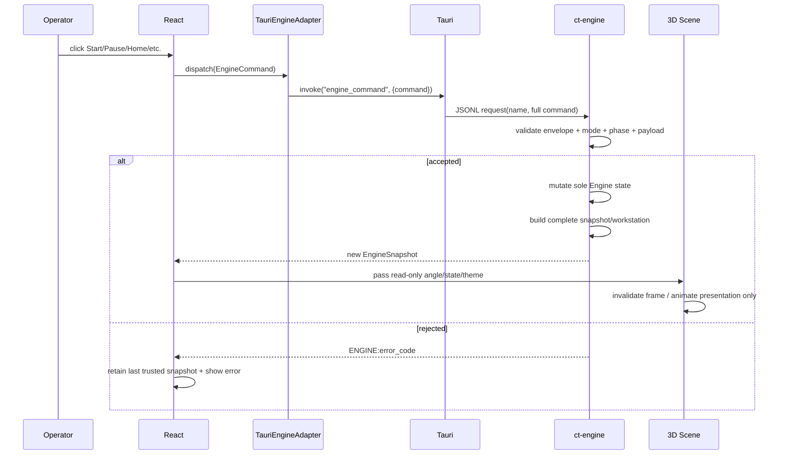
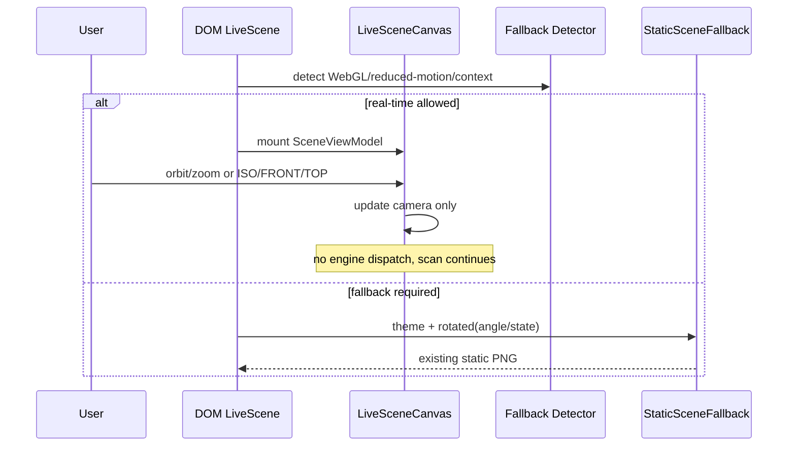
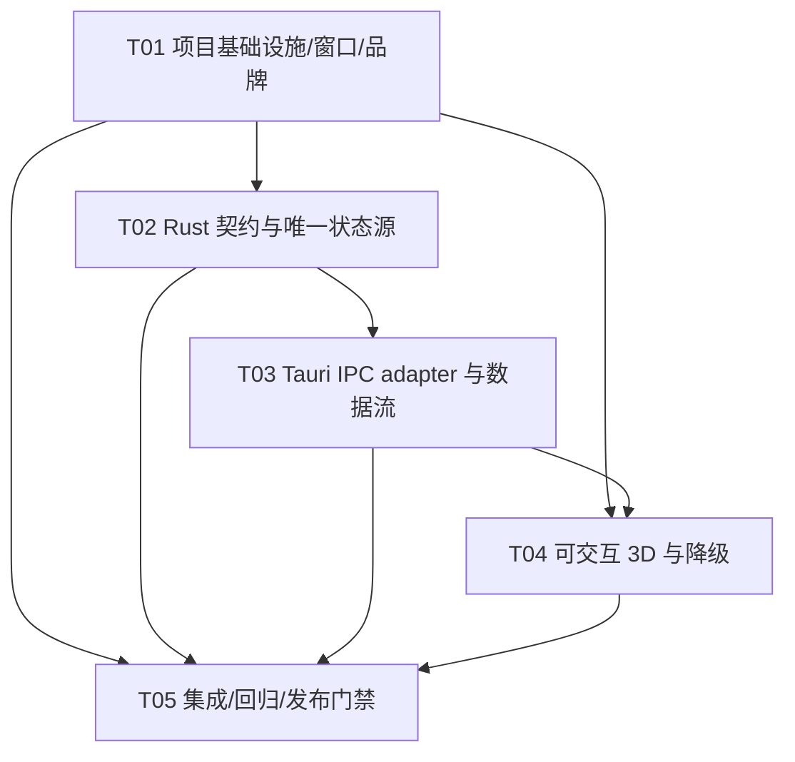

# Micro-CT Workstation 阶段 1–3 增量实施架构与任务计划

> [!CAUTION]
> **历史计划 / 已被取代（Superseded）**  
> 本文保留用于追溯阶段 1–3 的早期实施决策，**不再是当前实现、维护或验收的权威依据**。正文中的旧窗口尺寸与最小限制、侧栏内部滚动、默认图片路径、三维改造范围及测试/验收口径仅作历史记录，可能与最终实现冲突。  
> 当前权威依据为 [`system_design.md`](./system_design.md)、[`3d-model-and-camera-guide.md`](./3d-model-and-camera-guide.md) 与仓库实际源码；发生不一致时，一律以后述权威材料和实际源码为准。请勿依据本文恢复旧的 1366×768、1600×900、侧栏滚动或路径拼接方案。

> 文档原状态（历史）：已批准进入实施，曾供 Engineer 与 QA 作为阶段 1–3 实施基线。  
> 范围：阶段 1（窗口与视觉）+ 阶段 2（中央可交互 3D）+ 阶段 3（Tauri IPC / `ct-engine` 唯一状态源）。  
> 明确不实施：阶段 4 真实设备接入；仅保留 Rust adapters / bridges 边界。  
> 已验证基线：TypeScript typecheck、Vite/Sites build、Sites 4/4、Rust 8/8 均通过，后续不得以重构为由降低基线。

---

## 0. 设计输入与现状结论

本方案在阅读以下现有材料与关键代码后制定：

- `../../前端/重构交接说明.md`
- `../../前端/3D交互方案.md`
- `../../前端/设计说明.md`
- `ARCHITECTURE.md`
- `src/App.tsx`、`src/styles.css`、`src/tokens.css`
- `src/engine/types.ts`、`adapter.ts`、`useEngine.ts`、`workstationAdapter.ts`
- `src-tauri/tauri.conf.json`、`src-tauri/src/main.rs`、`engine_client.rs`
- `crates/ct-engine/src/lib.rs`、`main.rs`
- `../../kernal/software/host/CONTROL_WORKFLOW.md`
- `../../kernal/software/host/WINDOWS_MIGRATION.md`
- `../../kernal/software/host/rts9060_workflow.py` 及已验证测试/验收记录

### 已确认的架构断点

1. `src/engine/adapter.ts` 当前无条件构造 `WorkstationAdapter`，因此 **Tauri 桌面应用没有经过 `invoke`、Tauri Rust 和 sidecar**。
2. TypeScript `EngineSnapshot` 已声明可选的 `workstation?: WorkstationView`，但 Rust `ct-engine::snapshot()` 不返回该块；若恢复 Tauri adapter，`App.tsx` 会因为 `!ws` 一直停留在 boot screen。
3. 前端已使用新版命令 `retry_device`、`xray_toggle`、`timer_toggle`、`usb_auto_shut_down_toggle`、`send_voltage`、`send_current`、`update_scan_setup`、`estop_release`；Rust engine 仅支持旧命令子集。
4. `src-tauri` 现有 `engine_snapshot` / `engine_command`、`EngineClient`、版本化 JSONL envelope 和 sidecar 生命周期是可用基础，不需要重画传输层或改变进程边界。
5. Rust debug sidecar 的 `--preview` 明确表示“开发预览、无真实硬件”；release 默认 `production_locked`。该 fail-closed 语义必须保留。
6. `kernal/software` 已验证流程强调：任务真相归宿主工作流；实际射线状态必须来自完整、最新实测状态；未知不能当 OFF，更不能用设定值伪装监测值。阶段 1–3 只吸收这些安全边界，不移植真实硬件实现。

---

# Part A：系统设计

## 1. 实施方式与架构决策

### AD-01：保留现有四层进程/模块边界

```text
React / TypeScript UI
        │ EngineAdapter
        ├─ Tauri WebView ── invoke ── Tauri EngineClient ── JSONL stdio ── ct-engine
        │
        └─ 普通浏览器 / Vite / Sites ── WorkstationAdapter（仅开发预览）
```

- 不更换 Tauri 2、React/TypeScript 或 Rust sidecar。
- 不把 `ct-engine` 合入 Tauri 进程。
- 不把 RTS9060、相机 SDK、Moxtek 或真实串口代码放入前端。
- `ct-engine` 是桌面运行时唯一领域状态源；Tauri 只做生命周期、传输和 envelope 校验。
- 浏览器适配器只用于 UI 开发和 Sites 展示，必须持续显示 `DEVELOPER PREVIEW / NO REAL HARDWARE`，不能显示真实设备在线。

### AD-02：恢复 Tauri adapter，禁止静默降级

新增 `TauriEngineAdapter`，使用 `@tauri-apps/api/core` 的 `invoke`：

- `getSnapshot()` → `invoke<EngineSnapshot>("engine_snapshot")`
- `dispatch(command)` → `invoke<EngineSnapshot>("engine_command", { command })`

`createEngineAdapter()` 只按运行环境选一次：

- 存在 Tauri 官方运行时标志/内部对象 → `TauriEngineAdapter`
- 普通浏览器 → `WorkstationAdapter`

**禁止**：Tauri 调用失败时捕获异常并回落到 `WorkstationAdapter`。这会把 engine 崩溃或生产锁定伪装成正常在线，突破安全边界。失败时保留错误、最后一次可信快照，并在 UI 明确显示 engine unavailable / locked。

### AD-03：协议 envelope 暂不升级，payload 做向后兼容扩展

现有 `PROTOCOL_VERSION = 1` 已覆盖 request id、命令、payload、时间、序列和 error code。阶段 3 不改变 envelope 语义，只扩展 snapshot payload 与命令集合，原因：

- 不需要为新增字段重写稳定的 stdio 传输。
- JSON 对象增加 `workstation` 字段对旧消费者是兼容扩展。
- TS 与 Rust 使用相同 camelCase JSON 契约即可。
- 若后续阶段 4 引入真实设备能力协商或 breaking schema，再单独提升 protocol version。

### AD-04：Rust 产生工作台视图，UI 不自行推进桌面状态

Rust `Engine` 增加生成 `WorkstationView` 的纯映射函数；桌面 UI 所见状态由同一份 `Engine` 字段派生：

- phase / preflight / homed
- parameters / progress / current angle
- preview x-ray controller values
- logs / frames / checkpoint flag
- device、dock、安全条、statusbar 等展示派生字段

短期允许 Rust 返回 UI 友好的 `workstation` DTO，以最小改动接上现有 `App.tsx`。但命令是否允许、扫描是否推进、角度与进度如何变化必须由 Rust 领域状态决定，而非 React 或 Tauri 再维护第二套状态。

### AD-05：新版命令按安全等级处理

| 命令类别 | 命令 | 阶段 3 处理 |
|---|---|---|
| 核心工作流 | `connect`、`disconnect`、`preflight`、`home`、`start_scan`、`pause`、`resume`、`restore_previous`、`stop` | 继续由 Rust 状态机唯一处理 |
| 参数 | `set_parameters`、`update_scan_setup` | Rust 校验后原子更新；活动扫描拒绝 |
| 预览控制台 | `retry_device`、`timer_toggle`、`usb_auto_shut_down_toggle`、`send_voltage`、`send_current`、`xray_toggle` | 只在显式 `developer_preview` 下处理；release `production_locked` 拒绝 |
| 故障恢复 | `estop_release` | 只解除软件预览锁存，之后仍要求重新预检与 HOME；不能直接回 READY |

特别规则：

- `xray_toggle` 只改变 **开发预览状态**，不得宣称真实射线开启。
- 生产锁定模式除 `snapshot`、`stop`、`disconnect` 外继续拒绝领域/控制命令。
- `send_voltage/current` 做有限数、范围与 12 W 组合功率校验；这是预览输入校验，不是厂家设备精度声明。
- `stop` 必须立即令 beam preview false，并使 preflight / home 失效。
- 未知状态不得序列化为 `ENGINE ONLINE`、`3 / 3 ONLINE` 或 `TUBE OFF` 的肯定真实硬件陈述；这些文案在 preview 下必须带预览身份。

### AD-06：R3F Canvas 是独立只读展示模块

中央 3D 使用：

- `three`
- `@react-three/fiber`
- `@react-three/drei`

架构约束：

- Canvas 仅接收 `SceneViewModel`：`dataState`、`angleDeg`、`theme` 和设备展示状态。
- Canvas **不接收 engine dispatch**，不执行 `start_scan` / `pause` / `home`，不写任何工作流状态。
- Dock、状态浮窗、角度读数、安全条和工具条仍是 DOM 覆盖层。
- R3F 事件只改变本地相机视角/hover，不改变 engine 状态。
- 使用程序化轻量几何，不加载大 GLTF、不引入物理引擎或后处理全家桶。

### AD-07：3D 几何与光路约束集中配置

`scene-config.ts` 是机械展示参数的唯一入口：

- 原点：转台回转轴
- Y：竖直回转轴
- Z：源至相机的光轴
- 源焦点、样品中心、闪烁体板中心、镜头中心共享同一 `OPTICAL_AXIS_Y`
- 排列为 `SOURCE_Z < SAMPLE_Z < SCINTILLATOR_Z < LENS_Z`
- 射线几何从源出束窗连续穿过样品、闪烁体板，最终指向镜头，禁止弯折
- 相比现状：转台可见高度缩小，样品放大并落在台面顶面

开发期增加纯函数断言/测试，验证四点 X/Y 共线与 Z 顺序，避免靠目测破坏物理表达。

### AD-08：3D 性能与降级优先于效果

- `Canvas frameloop="demand"`
- `dpr={[1, 1.75]}`，低帧率可进一步降到 1
- `gl={{ alpha: true, antialias: false }}`，CSS 提供 `--sceneBg`
- `OrbitControls`：阻尼、禁平移、俯仰 12°–78°、zoom 0.6–2.2
- ISO / FRONT / TOP 三个受控预设机位
- reduced motion 下禁用补间、呼吸和自动旋转
- WebGL 不可用、Context 丢失、reduced motion 策略触发时，回退现有 `3D-scene-{light|dark}[-144].png`
- 降级只替换画布内容，不替换 DOM 覆盖层，不改变 engine 状态

### AD-09：窗口使用原生标题栏，启动最大化但不独占全屏

`src-tauri/tauri.conf.json`：

- 保留 `decorations: true`，不做无边框自绘标题栏。
- `maximized: true`，不设置 `fullscreen`。
- 设计尺寸仍为 1600×1000 参考；合理最小尺寸建议 `1366×768`。若实测 125%/150% DPI 下侧栏溢出，优先调整 CSS 紧凑规则，不强行提高最小尺寸。
- 保留 `resizable: true`。
- 不在普通菜单/工具条设置 `data-tauri-drag-region`；原生标题栏已负责拖动。

最大化/还原稳定性通过 CSS 容器尺寸而非窗口状态分支实现：固定上下栏，主区域 `minmax(0,1fr)`，侧栏在低高度内部滚动，3D 使用 `ResizeObserver` / R3F 自适应尺寸。

### AD-10：品牌资产必须有真实 Alpha

现有 `public/assets/micro-ct-logo.png` 视觉上带白色矩形底，不满足透明 Logo。实施要求：

- 产出透明背景主 Logo，保留内部设计中的必要白色形状，但移除外部白底。
- 同源生成全尺寸 Tauri icon 集：`.ico`、`.icns`、32、64、128、256/512 及 Windows Store/Square 变体。
- 图标四周留安全边距，Windows 小尺寸不截边、不出现白方块。
- 不通过 CSS `mix-blend-mode`、滤镜或裁切伪造透明。

---

## 2. 增量文件列表

以下列表只列阶段 1–3 新增或修改文件，不重排现有项目目录。

### 项目与窗口

| 路径 | 操作 | 内容 |
|---|---|---|
| `package.json` | 修改 | 增加 Three/R3F/drei 依赖与必要测试脚本 |
| `package-lock.json` | 修改 | 锁定新增依赖 |
| `src-tauri/tauri.conf.json` | 修改 | 最大化、合理最小尺寸、保留原生标题栏；CSP 增加 WebGL 所需最小策略时再精确调整 |
| `src-tauri/icons/*` | 替换 | 从透明源生成完整桌面图标集 |
| `public/assets/micro-ct-logo.png` | 替换 | 透明背景主 Logo |

### React UI 与样式

| 路径 | 操作 | 内容 |
|---|---|---|
| `src/App.tsx` | 修改 | 拆出/接入实时 3D；运行身份徽章；DOM 覆盖层继续保留；无 `workstation` 时显示明确 locked/unavailable 而非无限 linking |
| `src/styles.css` | 修改 | 稳定最大化/还原布局、压缩留白、字体层级、Canvas 层叠、响应式与 reduced-motion |
| `src/tokens.css` | 修改 | 补齐 3D、透明玻璃和层级令牌，移除散落硬编码色；保留双主题唯一色源 |
| `src/vite-env.d.ts` | 修改 | 仅在确需 Tauri 运行时全局类型时补充声明；优先用官方 API，避免自定义全局泛滥 |

### 3D 场景模块（新增）

| 路径 | 责任 |
|---|---|
| `src/scene/types.ts` | `SceneViewModel`、主题、预设机位、降级原因类型 |
| `src/scene/scene-config.ts` | 坐标、尺寸、光轴、相机预设与控制约束唯一配置 |
| `src/scene/theme-three.ts` | 从 CSS variables 读取 Three 色彩/透明度，监听主题变化 |
| `src/scene/EquipmentScene.tsx` | 源、缩短转台、放大样品、板、镜头、光路、射线、灯光 |
| `src/scene/LiveSceneCanvas.tsx` | R3F Canvas、正交相机、OrbitControls、preset 控制、context-loss 处理 |
| `src/scene/useSceneFallback.ts` | WebGL、reduced-motion、低帧率/Context 丢失降级判定 |
| `src/scene/StaticSceneFallback.tsx` | 复用现有主题×角度静态 PNG 的等价降级内容 |

### TypeScript engine 层

| 路径 | 操作 | 内容 |
|---|---|---|
| `src/engine/types.ts` | 修改 | 固化 JSON DTO、命令 payload、runtime identity；保持 `WorkstationView` 与 Rust 同构 |
| `src/engine/tauriAdapter.ts` | 新增 | `invoke` 实现的 Tauri adapter |
| `src/engine/adapter.ts` | 修改 | Tauri/浏览器运行时选择；禁止错误后静默回落 |
| `src/engine/useEngine.ts` | 修改 | 初始化、轮询、命令串行化/竞态控制、最后可信快照和 transport error 语义 |
| `src/engine/workstationAdapter.ts` | 修改 | 仅浏览器预览；身份文案不伪装真实在线；与共同契约保持一致 |
| `src/engine/rts9060/workflow.ts` | 条件修改 | 仅当浏览器 preview 需要对齐契约；不得成为桌面状态源 |

### Rust / IPC

| 路径 | 操作 | 内容 |
|---|---|---|
| `crates/ct-engine/src/lib.rs` | 修改 | Rust DTO、工作台视图映射、新命令、预览安全校验、契约测试 |
| `crates/ct-engine/src/main.rs` | 小改/保持 | JSONL 主循环保持；必要时只改善错误 payload，不改边界 |
| `src-tauri/src/main.rs` | 小改 | invoke 返回 DTO；窗口 setup 如需运行时 maximize 作为配置兜底；不保存领域状态 |
| `src-tauri/src/engine_client.rs` | 小改/保持 | 保持 sidecar、序列和超时；仅改善错误分类/退出语义，不重写传输 |
| `src-tauri/capabilities/default.json` | 检查后最小修改 | 仅在官方 Tauri API 需要权限时增加最小权限；不开放 shell/filesystem/hardware |

### 验证

| 路径 | 操作 | 内容 |
|---|---|---|
| `crates/ct-engine/src/lib.rs` 的 `tests` | 扩充 | snapshot schema、新命令、生产锁定、stop/estop、参数事务性 |
| `tests/sites-worker.test.mjs` | 保持/小改 | 确认新增 3D bundle/静态资源仍可 Sites 发布 |
| `src/scene/*.test.ts` | 可新增 | 光轴共线、scene config、fallback 判定纯函数测试 |
| `src/engine/*.test.ts` | 可新增 | adapter 运行时选择与禁止 Tauri 静默回退；如新增 Vitest 应随 T01 一次性配置 |

---

## 3. 数据结构与 TypeScript / Rust 契约

### 3.1 契约原则

1. JSON 字段统一 camelCase。
2. 时间使用 ISO 8601 UTC；角度内部至少保留 3 位小数，UI 显示 2 位。
3. kV / µA / W / °C 为有限数字；显示层统一一位小数。
4. `EngineSnapshot` 是完整替换快照，不是 React 侧增量 patch。
5. `workstation` 在完成阶段 3 后对 Tauri debug preview 应为必有；为迁移兼容可在 TS 类型中暂时保留可选，但 UI 必须对缺失给出协议错误。
6. 预览状态要同时用 `mode`、`modeLabel`、`adapterLabel`、设备 detail 表明无真实硬件。

### 3.2 TypeScript 接口目标

```ts
export type EngineMode = "production_locked" | "developer_preview";
export type AdapterKind = "tauri" | "developer_preview";

export interface EngineSnapshot {
  mode: EngineMode;
  modeLabel: string;
  connectionState: "disconnected" | "connected" | "degraded" | "lost";
  adapterLabel: string;
  phase: EnginePhase;
  phaseLabel: string;
  preflightPassed: boolean;
  homed: boolean;
  requiresPreflight: boolean;
  requiresHome: boolean;
  safety: SafetyState;
  devices: DeviceStatus[];
  parameters: ScanParameters;
  progress: ScanProgress;
  imageCount: number;
  logs: LogEntry[];
  lastError: string | null;
  updatedAt: string;
  workstation?: WorkstationView;
}

export interface SceneViewModel {
  dataState: "ready" | "scanning" | "paused" | "fault";
  angleDeg: number;
  theme: "light" | "dark";
  beamOn: boolean;
  xrayLatched: boolean;
}
```

`EngineCommand` 保持判别联合，并确保 `update_scan_setup.setup` 对应 Rust DTO：

```ts
interface ScanSetupInput {
  savePath: string;
  taskId: string;
  projectionCount: number;
  exposureMs: number;
  maxXraySec: number;
}
```

### 3.3 Rust DTO 目标

Rust 侧使用 `#[serde(rename_all = "camelCase")]` 定义明确结构，减少手写 `json!` 漏字段：

```rust
#[derive(Clone, Debug, Serialize)]
#[serde(rename_all = "camelCase")]
pub struct EngineSnapshotDto {
    pub mode: EngineModeDto,
    pub mode_label: String,
    pub connection_state: ConnectionStateDto,
    pub adapter_label: String,
    pub phase: String,
    pub phase_label: String,
    pub preflight_passed: bool,
    pub homed: bool,
    pub requires_preflight: bool,
    pub requires_home: bool,
    pub safety: SafetyStateDto,
    pub devices: Vec<DeviceStatusDto>,
    pub parameters: Parameters,
    pub progress: ScanProgressDto,
    pub image_count: u32,
    pub logs: Vec<LogEntryDto>,
    pub last_error: Option<String>,
    pub updated_at: String,
    pub workstation: WorkstationViewDto,
}
```

命令解析优先使用带标签 enum，而不是散落索引：

```rust
#[derive(Debug, Deserialize)]
#[serde(tag = "type", rename_all = "snake_case")]
pub enum EngineCommandDto {
    Connect { adapter: AdapterRequestDto },
    Disconnect,
    Preflight,
    Home,
    StartScan,
    Pause,
    Resume,
    RestorePrevious,
    Stop,
    SetParameters { parameters: Parameters },
    EstopRelease,
    RetryDevice { device: DeviceIdDto },
    XrayToggle,
    TimerToggle,
    UsbAutoShutDownToggle,
    SendVoltage { kv: f64 },
    SendCurrent { ua: f64 },
    UpdateScanSetup { setup: ScanSetupInputDto },
}
```

由于现有 Tauri 将命令名同时放在 envelope `command` 和 payload `type` 中，阶段 3 先保留现状，但 Rust 必须校验两者一致，避免 `command="stop"`、payload `type="start_scan"` 的歧义。

### 3.4 类/服务关系



---

## 4. 程序调用流与数据流

### 4.1 桌面初始化与快照

```mermaid
sequenceDiagram
    participant UI as React App/useEngine
    participant A as TauriEngineAdapter
    participant T as Tauri command
    participant C as EngineClient
    participant E as ct-engine

    UI->>A: createEngineAdapter()
    Note over UI,A: Tauri runtime detected; no preview fallback
    UI->>A: getSnapshot()
    A->>T: invoke("engine_snapshot")
    T->>C: request("snapshot", {})
    C->>E: protocol-v1 JSONL Request
    E->>E: tick() + build EngineSnapshotDto/workstation
    E-->>C: JSONL Response
    C->>C: validate version/requestId/sequence/command
    C-->>T: payload
    T-->>A: EngineSnapshot
    A-->>UI: EngineSnapshot
    UI->>UI: render console + derive SceneViewModel
```

若 Tauri invoke/sidecar 失败，流程止于错误展示；不得调用 `new WorkstationAdapter()`。

### 4.2 浏览器开发预览



### 4.3 命令与状态推进



### 4.4 3D 预设与降级



---

## 5. 阶段验收标准

### 阶段 1：窗口、布局与视觉

1. Windows 桌面启动后最大化，但仍显示原生 Windows 标题栏；任务切换、最小化、还原正常，非独占全屏。
2. 最小窗口不小于约 1366×768；1440×900、1600×1000、1920×1080 与常见 DPI 下无横向页面溢出。
3. 最大化↔还原期间主三栏不抖动、不突然换成另一套字号；中央场景自适应，侧栏必要时内部滚动。
4. 移除不必要 `draggable` / 自定义拖拽区域；图像显式 `draggable={false}` 仅为防误拖，不做窗口拖拽。
5. 压缩无效留白，保证中央 3D 和工程读数优先；标题、正文、规格、日志层级清晰。
6. 所有颜色通过 `tokens.css`；清理现有样式中可替换的 `#fff`、状态浮窗硬编码色，补为主题令牌。
7. Logo 外部背景透明；Tauri 图标在 16/32/48/256 等尺寸无白方块、无裁切、清晰可识别。
8. `npm run typecheck`、`npm run build`、Sites 4/4 继续通过。

### 阶段 2：真实可交互 3D

1. 中央视口为真实 WebGL/R3F Canvas；鼠标拖拽旋转、滚轮缩放可用，平移禁用。
2. 俯仰角限制生效，无法钻到地面以下或看到明显穿模内部。
3. ISO / FRONT / TOP 三预设均可切换；正常 motion 约 600 ms 补间，reduced motion 立即切换。
4. 设备为程序化轻量几何；转台较现有构图显著缩短，样品显著放大并贴合台面。
5. X-ray 源→样品→闪烁体板→镜头四点共线，FRONT 视角可直观看出无折线。
6. 转台 3D 朝向、场景角度读数、Operation ANGLE、设备 POS 来自同一 engine snapshot。
7. READY/SCANNING/PAUSED/FAULT 射线透明度由令牌映射；FAULT 立即为 0。注意这是状态可视化，不是实际剂量证明。
8. 拖拽、缩放、切预设不会发送 engine 命令，不会暂停扫描或改变日志。
9. 静止时 `frameloop="demand"` 不持续满帧渲染；dpr 上限 1.75。
10. WebGL 不可用、Context 丢失或 reduced-motion 降级时显示现有主题×角度静态图，覆盖层和扫描状态仍正常。

### 阶段 3：IPC 与唯一状态源

1. Tauri 运行时 `adapterKind === "tauri"`，`engine_snapshot` / `engine_command` 可在 Rust/sidecar 日志或测试桩中证明被调用。
2. 普通 `npm run dev` / Sites 才使用 `WorkstationAdapter`，且显示开发预览/无真实硬件。
3. Tauri sidecar 故障时显示不可用，不自动切换到浏览器内存扫描。
4. Rust snapshot 含完整 `workstation`，现有控制台不再永久 boot。
5. 前端当前使用的全部命令在 Rust 有明确“执行或安全拒绝”结果，不出现 `UNKNOWN_COMMAND` 的架构遗漏。
6. 所有状态变化首先发生在 `ct-engine`，Tauri 与 React 不保存第二份可推进扫描的领域状态。
7. `stop` 令出束预览立即关闭，并使预检/回零失效；`estop_release` 后必须重新预检和 HOME，不能直接 Start。
8. `production_locked` 不显示真实在线、真实 beam on 或 3/3 online；不会回退 preview。
9. JSONL envelope 的版本、request id、command、sequence 校验仍通过；命令名与 payload type 不一致会拒绝。
10. Rust 原 8 项测试继续通过，新增契约/命令/安全测试全部通过；`npm run tauri:dev` 能启动。

---

## 6. 不清楚项与本方案假设

需求方已明确不再澄清，本方案采用以下保守假设：

1. **最小尺寸**：以 1366×768 为合理起点；最终可基于 Windows 125%/150% DPI 实测微调，但不得低于可操作下限。
2. **最大化实现**：首选 `tauri.conf.json` 的 `maximized: true`；若具体 Tauri/WebView2 版本启动时不稳定，可在 `setup` 对 `main` window 调用一次 maximize 兜底，二者不可形成反复切换。
3. **reduced-motion**：按用户要求视为静态图降级，而不仅仅取消动画；这比 `3D交互方案.md` 原文更保守。
4. **FRONT 的视角定义**：正对光轴侧视，以能验证源→物→板→镜头对中为准；实施时由 `scene-config.ts` 固化。
5. **阶段 3 preview 命令**：可在 Rust debug preview 内模拟 UI 状态，但所有文案必须标注无真实硬件；release 始终锁定。
6. **Logo**：允许从现有品牌图中抠除外部白底并生成衍生尺寸，不改变品牌图形本身。
7. **测试框架**：若项目不希望新增 Vitest，可将纯 TS 断言纳入 typecheck/build 和手工验收；但 Rust 契约与安全行为必须自动测试。

---

# Part B：任务分解

## 7. 所需第三方依赖

新增：

```text
- three@^0.180.0: Three.js WebGL 渲染核心（安装时使用与 R3F 当前 peer 兼容的稳定版本）
- @react-three/fiber@^9.0.0: React 19 对应的 Three renderer
- @react-three/drei@^10.0.0: OrbitControls、RoundedBox、Environment 等轻量 helpers
- @types/three@^0.180.0: Three.js TypeScript 类型（若 three 版本仍需独立类型包）
```

可选，仅当 Engineer 为 TS 层新增自动测试时：

```text
- vitest@^3.0.0: adapter 选择、scene config 与 fallback 纯函数测试
- jsdom@^26.0.0: 浏览器运行时/媒体查询测试环境
```

继续使用：

```text
- react@19.2.0 / react-dom@19.2.0
- @tauri-apps/api@^2.11.1 / @tauri-apps/cli@^2.11.4
- vite@6.4.2 / typescript@^7.0.2
- Rust: serde / serde_json / chrono / tauri 2（不引入新异步运行时）
```

版本原则：实际安装前以 npm peer dependency 解算结果为准，同一次提交更新 `package.json` 与 lockfile，不使用 `--force` 绕过冲突。

---

## 8. 任务清单（按依赖排序，最多 5 项）

### T01：项目基础设施、窗口与品牌资产

- **Source Files**：`package.json`、`package-lock.json`、`src-tauri/tauri.conf.json`、`src-tauri/capabilities/default.json`、`src/main.tsx`、`src/App.tsx`、`src/styles.css`、`src/tokens.css`、`public/assets/micro-ct-logo.png`、`src-tauri/icons/*`
- **Dependencies**：无
- **Priority**：P0
- **内容**：
  - 一次性安装 Three/R3F/drei 与测试依赖（若采用）。
  - 配置最大化、原生标题栏、最小尺寸与可缩放窗口。
  - 建立稳定应用 grid、低高度内部滚动、字体层级、紧凑留白和 Canvas 层叠基础。
  - 生成透明 Logo 与全尺寸图标。
  - 保持入口与现有主题初始化；不在此任务实现 engine 业务。
- **完成标准**：阶段 1 的窗口/视觉项通过，且 typecheck/build/Sites 基线未回退。

### T02：Rust `ct-engine` 工作台契约与安全状态源

- **Source Files**：`crates/ct-engine/src/lib.rs`、`crates/ct-engine/src/main.rs`、`src-tauri/src/engine_client.rs`、`src-tauri/src/main.rs`、`src/engine/types.ts`
- **Dependencies**：T01（仅依赖依赖/配置基线；实际 Rust DTO 可尽早并行开发）
- **Priority**：P0
- **内容**：
  - 用 serde DTO 输出完整 `EngineSnapshot` + `WorkstationView`。
  - 对齐 TypeScript 判别联合命令。
  - 实现/安全拒绝新版命令、参数校验、stop/estop 恢复规则。
  - 保持 protocol v1 envelope 与 sidecar 边界。
  - 扩充生产锁定、schema、命令一致性与 fail-closed 测试。
- **完成标准**：Rust 所有测试通过；snapshot 可直接被现有 UI 消费；production 不伪装在线。

### T03：恢复 Tauri IPC adapter 与前端唯一数据流

- **Source Files**：`src/engine/tauriAdapter.ts`、`src/engine/adapter.ts`、`src/engine/useEngine.ts`、`src/engine/workstationAdapter.ts`、`src/engine/types.ts`、`src/App.tsx`
- **Dependencies**：T02
- **Priority**：P0
- **内容**：
  - 实现 Tauri invoke adapter 和运行时选择。
  - 普通浏览器保留 developer preview。
  - 禁止 IPC 错误静默回退；呈现 transport/contract error。
  - 避免轮询与 dispatch 旧快照覆盖新快照：命令期间暂停普通 refresh，或用单调 revision/请求序列只接受更新结果。
  - 对无 `workstation` 返回明确协议错误。
- **完成标准**：Tauri 实际走 sidecar；浏览器仅走 preview；UI 所有命令均由 Rust 状态推进。

### T04：中央可交互 3D、主题联动与静态降级

- **Source Files**：`src/scene/types.ts`、`src/scene/scene-config.ts`、`src/scene/theme-three.ts`、`src/scene/EquipmentScene.tsx`、`src/scene/LiveSceneCanvas.tsx`、`src/scene/useSceneFallback.ts`、`src/scene/StaticSceneFallback.tsx`、`src/App.tsx`、`src/styles.css`、`src/tokens.css`
- **Dependencies**：T01；与 T02 可并行，最终集成依赖 T03 的可信快照
- **Priority**：P0
- **内容**：
  - 隔离 R3F Canvas，建立程序化设备几何与光轴。
  - 缩短转台、放大样品、加入闪烁体板。
  - OrbitControls 限角禁平移，ISO/FRONT/TOP。
  - angle/state/theme 只读联动，射线安全映射。
  - WebGL/reduced-motion/context-loss 静态图降级。
  - 保证 DOM 覆盖层和 Dock 点击层级。
- **完成标准**：阶段 2 全部验收项通过；交互不发送 engine 命令，静止不持续满帧。

### T05：跨层集成、回归验证与发布门禁

- **Source Files**：`src/App.tsx`、`src/styles.css`、`src/tokens.css`、`src/engine/*.ts`、`src/scene/*.tsx`、`crates/ct-engine/src/lib.rs`、`tests/sites-worker.test.mjs`、`docs/PHASE-1-3-IMPLEMENTATION-PLAN.md`
- **Dependencies**：T01、T02、T03、T04
- **Priority**：P0
- **内容**：
  - 按阶段验收矩阵逐项回归。
  - 运行 typecheck、build、Sites、Rust、Tauri dev。
  - Windows 最大化/还原与 DPI 手工验收；WebGL/reduced-motion 降级验收。
  - 搜索并阻止前端硬件实现、Tauri preview 回退、错误在线文案和硬编码主题色。
  - 记录未实施的真实设备边界，不把阶段 4 状态写成已完成。
- **完成标准**：所有门禁通过；没有未解决 P0；能够单独回滚每阶段。

---

## 9. 共享知识与工程约束

- `ct-engine` 是桌面扫描/设备状态唯一真相源；React、Tauri 和 3D 不自行推进状态。
- 所有 IPC 响应是完整 snapshot；错误通过 envelope `error_code` / Tauri error 传播，UI 保留最后可信快照。
- 所有日期时间为 ISO 8601 UTC；UI 可本地化显示但不修改原值。
- 所有角度内部至少 0.001°，显示 0.01°；默认五视角为 0/72/144/216/288。
- 96000 pulses/rev 是现有机械口径；3D 只展示角度，不计算真实运动节拍。
- 3D 是纯展示层，不能直接 dispatch engine 命令，也不能访问串口/文件系统/相机。
- Tauri IPC 失败绝不回落浏览器模拟。
- release `production_locked` 不自动变 preview；真实设备尚未实现时保持 locked/offline。
- 设定值不是实测值；未来设备状态 unknown 不能显示成 OFF/OK。
- `stop` / disconnect 使 preflight 和 home 失效；恢复扫描前必须重新建立安全条件。
- 颜色只从 CSS variables 读取；Three 通过 `theme-three.ts` 读取同一令牌，不复制十六进制色表。
- DOM 负责文字、按钮、玻璃和可访问性；WebGL 只负责设备与射线。
- 不开放 Tauri shell、任意文件系统或硬件 capability。
- 不提交 `dist/`、`target/`、sidecar binary 或临时图标源文件，除非现有发布流程明确要求。

---

## 10. 任务依赖图



为减少线性阻塞，T02 的 Rust DTO/测试和 T04 的程序化场景可在 T01 完成依赖安装后并行；T04 最后接入可信 engine snapshot 时再依赖 T03。

---

## 11. 风险、缓解与回滚

### R1：TS / Rust DTO 漂移

- **风险**：字段缺失导致 boot screen、错误状态或运行时 `undefined`。
- **缓解**：Rust 使用 DTO 而非大段 `json!`；对 snapshot 做 serde JSON shape 测试；前端对 `workstation` 缺失报 protocol error。
- **回滚**：保留基础 `EngineSnapshot` 字段；回滚 `workstation` 扩展和 Tauri adapter 的同一提交，不影响 JSONL envelope。

### R2：Tauri 检测误判或 IPC 失败后假在线

- **风险**：桌面误用内存 adapter，重复当前断点。
- **缓解**：adapter 选择单元测试；Tauri adapter 无 fallback；UI 展示 adapter/mode；QA 通过 invoke 桩或 Rust 日志验证链路。
- **回滚**：仅回滚 `adapter.ts/tauriAdapter.ts/useEngine.ts`，浏览器预览仍可运行；但不得发布该回滚为桌面完成版。

### R3：轮询覆盖命令结果

- **风险**：850 ms refresh 与 dispatch 并发，较旧 snapshot 后到达并覆盖新状态。
- **缓解**：单一请求队列、命令期间暂停 refresh，或使用本地 request revision 只提交最新响应；Rust sequence 继续保证传输单调。
- **回滚**：恢复简单轮询前先禁用高频刷新，以正确性优先。

### R4：Three/R3F 与 React 19 peer 兼容

- **风险**：依赖版本不匹配或 Vite build 体积/构建失败。
- **缓解**：先完成 T01 dependency spike，使用官方兼容版本和 lockfile；不引入额外后处理。
- **回滚**：`LiveSceneCanvas` 按组件边界切回 `StaticSceneFallback`，不影响其他 UI 与 IPC。

### R5：WebView2 WebGL / GPU 差异

- **风险**：老驱动黑屏、context lost、低帧率。
- **缓解**：启动能力探测、context-loss 捕获、dpr 限制、frameloop demand、程序化低面数几何和静态降级。
- **回滚**：按运行时开关全局强制静态 fallback；无需回滚 UI/engine。

### R6：窗口最大化与 DPI 布局抖动

- **风险**：Windows 125%/150% 缩放使固定栏位压缩中央内容。
- **缓解**：1366/1440 断点、侧栏内部滚动、中央 minmax(0,1fr)、不依赖 JS 读取 maximized 状态改变布局。
- **回滚**：恢复 1600×900 默认窗口但保留最小尺寸和 CSS 改进；不回滚原生标题栏。

### R7：射线动画被误解为真实输出

- **风险**：preview 可视化被操作员误认为真实在线/真实出束。
- **缓解**：全局 preview badge；device detail 明确无真实硬件；release locked；状态浮窗在真实能力未实现时避免无上下文的“ENGINE ONLINE”。
- **回滚**：生产/非 preview 模式强制隐藏射线或置 0，并显示 LOCKED。

### R8：Logo 去底破坏内部白色元素

- **风险**：简单白色阈值抠图会删掉品牌图内部必要白色区域。
- **缓解**：只从与画布边界连通的外部白底建立 alpha，人工检查边缘与小尺寸 icon。
- **回滚**：保留原始源图备份，重新生成衍生资产；代码无需回滚。

---

## 12. 阶段级回滚策略

| 阶段 | 推荐提交边界 | 可独立回滚内容 | 不应回滚的安全边界 |
|---|---|---|---|
| 1 | 窗口配置/布局/品牌一组 | 最大化、视觉、图标资产 | 原生标题栏、合理最小尺寸原则 |
| 2 | `src/scene` + App 接入一组 | 可把画布切到 `StaticSceneFallback` | 3D 不写 engine、FAULT 射线归零 |
| 3a | Rust DTO/命令/测试一组 | 若失败回到旧 Rust snapshot | production_locked、不伪装硬件 |
| 3b | Tauri adapter/hook 一组 | 可暂时禁用桌面发布并保留浏览器预览 | 不允许 Tauri 静默回落模拟 |

任何回滚后都必须重新运行全部门禁；不能为了恢复界面可用而用 `WorkstationAdapter` 冒充桌面 engine。

---

## 13. 最终验证命令与手工检查

```bash
npm run typecheck
npm run build
npm run test:sites
cargo test -p ct-engine
npm run tauri:dev
```

若新增前端测试：

```bash
npm run test:unit
```

手工矩阵：

- Windows：1366×768、1440×900、1600×1000、1920×1080；最大化→还原→最大化。
- Light / Dark × READY / SCANNING / PAUSED / FAULT。
- WebGL 正常 / 禁用或 context lost / reduced motion。
- Tauri sidecar 正常 / sidecar 不存在或终止。
- 普通浏览器 Vite / Sites 与 Tauri 桌面身份对照。
- ISO / FRONT / TOP，极限 orbit/zoom，Dock/工具条点击。
- stop / estop_release / preflight / home / start 的恢复门控。

交付判定：自动门禁全部通过、每阶段验收通过、真实设备仍明确未实施且不被 UI 伪装，即可完成阶段 1–3。