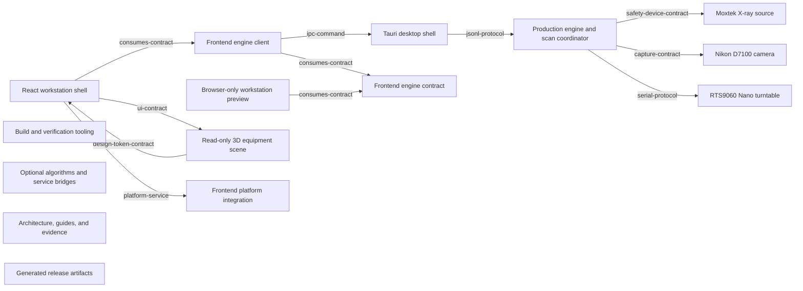

<!-- Generated by scripts/gen-module-graph.mjs. Do not edit by hand.
     Run `npm.cmd run module-map:generate` to regenerate. -->

# Module graph

An arrow `A --> B` means module A depends on module B. Impact analysis walks the arrows in reverse, because changing B can affect A.

## Modules

| Module | Risk | Responsibility | Required gates |
|---|---|---|---|
| `engine-core` | critical | Owns the JSONL API, safety gates, authoritative device state, and projection transaction ordering. | cargo test -p ct-engine |
| `device-xray` | critical | Owns Moxtek discovery, binary serial transport, measured readback, and fail-closed beam shutdown. | cargo test -p ct-engine devices::xray |
| `device-camera` | critical | Owns camera discovery, exposure configuration, host-side capture, and image-file confirmation. | cargo test -p ct-engine devices::camera |
| `device-turntable` | critical | Owns Nano identity validation, line protocol, motion acknowledgement, warning output, and emergency stop. | cargo test -p ct-engine devices::turntable |
| `desktop-shell` | critical | Owns native dialogs and paths, sidecar lifecycle, and IPC forwarding without owning scan state. | cargo test --workspace npm.cmd run test:sites |
| `frontend-contract` | critical | Defines the TypeScript command and snapshot vocabulary shared by production and preview clients. | npm.cmd run typecheck npm.cmd run test:sites |
| `frontend-client` | high | Selects the runtime adapter and exposes engine snapshots to React without fallback after Tauri errors. | npm.cmd run typecheck npm.cmd run test:sites |
| `developer-preview` | high | Simulates device and scan behavior for browser development; it never accesses physical hardware. | npm.cmd run typecheck npm.cmd run test:sites |
| `ui-shell` | medium | Owns panels, menus, safety presentation, layout, themes, and static UI assets. | npm.cmd run typecheck npm.cmd run test:sites npm.cmd run build |
| `scene` | medium | Owns visualization geometry, theme conversion, camera navigation, and WebGL fallback. | npm.cmd run typecheck npm.cmd run test:sites |
| `platform` | medium | Provides desktop-only paths, dialogs, directory reveal, and log export behind small functions. | npm.cmd run typecheck npm.cmd run test:sites |
| `build-tooling` | medium | Owns dependency locks, build entry points, contract tests, module-map generation, and impact analysis. | npm.cmd run module-map:check npm.cmd run test:sites |
| `extensions` | low | Holds optional algorithm contracts and the Sites-compatible static worker, outside the safety control loop. | npm.cmd run test:sites npm.cmd run build |
| `documentation` | low | Explains current architecture, operating constraints, historical plans, and verification evidence. | npm.cmd run module-map:check |
| `release-artifacts` | low | Contains replaceable packaged binaries and is never a source of design truth. | None |

## Hidden or semantic dependencies

| Consumer | Provider | Type | Strength | Reason |
|---|---|---|---|---|
| `ui-shell` | `frontend-client` | consumes-contract | strong | UI actions and rendering depend on the client hook and complete engine snapshots. |
| `frontend-client` | `frontend-contract` | consumes-contract | strong | Both runtime adapters must implement the exact EngineAdapter command and snapshot contract. |
| `developer-preview` | `frontend-contract` | consumes-contract | strong | Preview output must stay structurally and semantically compatible with production snapshots. |
| `frontend-client` | `desktop-shell` | ipc-command | strong | Tauri invoke command names and payload fields are string-based runtime contracts. |
| `desktop-shell` | `engine-core` | jsonl-protocol | strong | The shell and sidecar exchange versioned, sequence-checked JSONL request and response envelopes. |
| `engine-core` | `device-xray` | safety-device-contract | strong | Every exposure transaction depends on verified X-ray readback and fail-closed shutdown. |
| `engine-core` | `device-camera` | capture-contract | strong | Projection commit requires a confirmed host-side image file. |
| `engine-core` | `device-turntable` | serial-protocol | strong | Motion, warning, emergency stop, and CAPTURE_DONE use the external Nano protocol. |
| `ui-shell` | `scene` | ui-contract | medium | The application supplies a read-only scene view-model and owns all device commands. |
| `scene` | `ui-shell` | design-token-contract | medium | Scene colors and visibility semantics must follow the shared theme and safety state. |
| `ui-shell` | `platform` | platform-service | medium | Directory selection and log export cross the browser-to-desktop boundary. |
