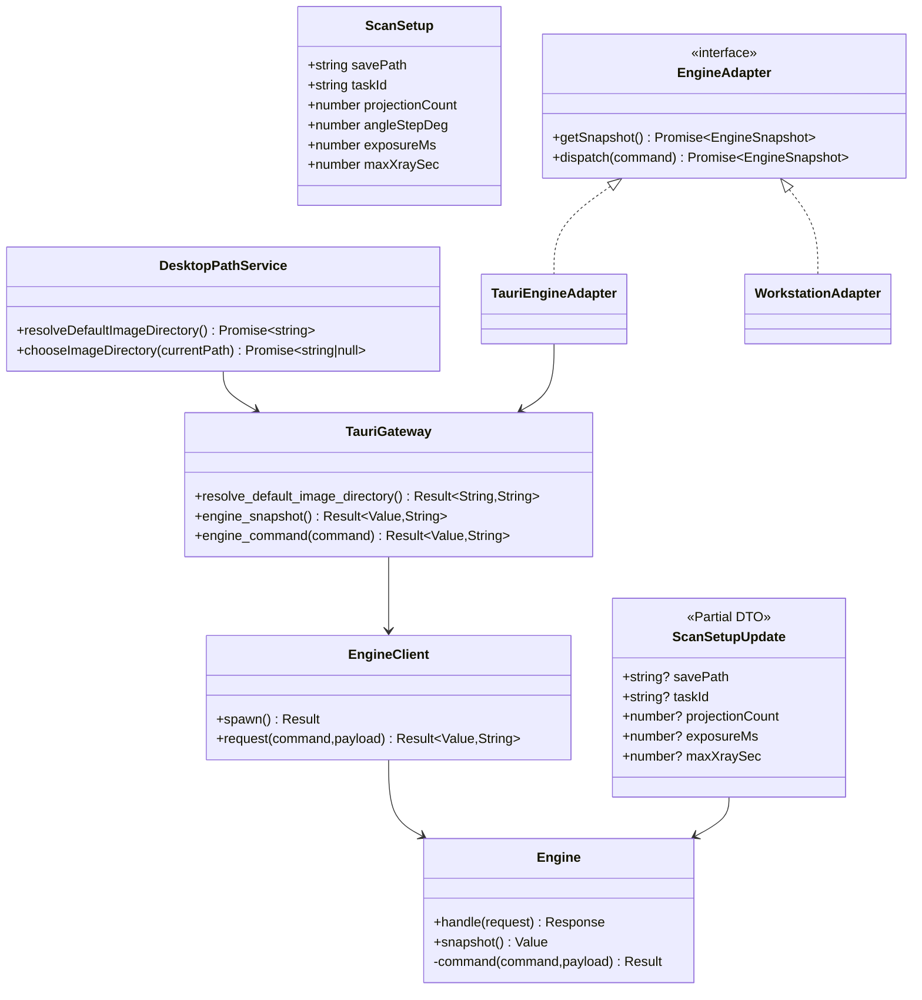
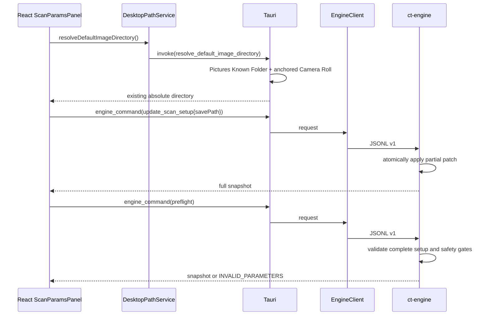
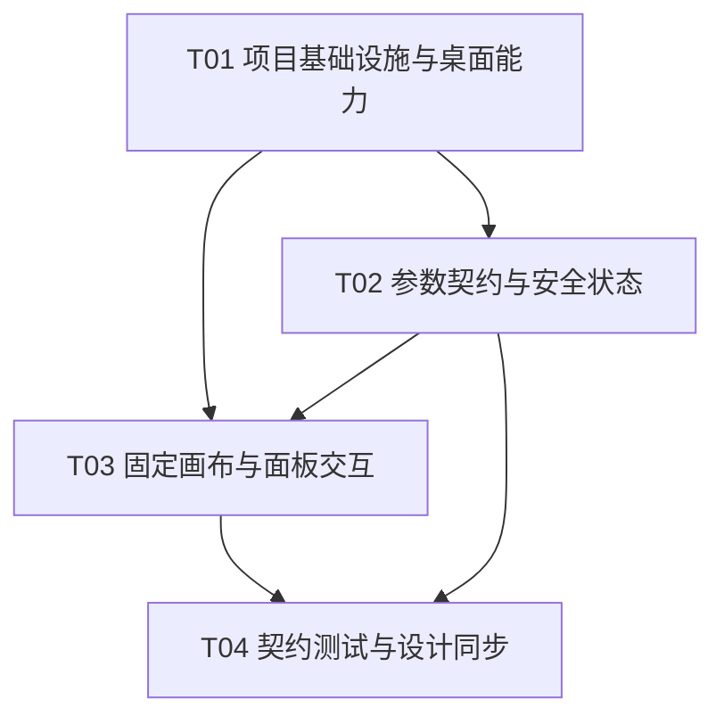

# Micro-CT Workstation 最终增量系统设计

> 本文描述当前最终实现。系统保持 **Tauri 2 + React/TypeScript + Rust `ct-engine` sidecar**：React 负责表现与表单 draft，Tauri 负责窗口、原生目录对话框和 sidecar 传输，`ct-engine` 负责参数、安全门控与扫描状态。三维场景源码本轮不修改，使用方式见 [`3d-model-and-camera-guide.md`](./3d-model-and-camera-guide.md)。

## Part A：系统设计

## 1. Implementation Approach

### 1.1 核心技术挑战

1. **固定工业画布适配不同工作区**：界面必须保持 1600×1000 设计坐标与固定三列，不允许响应式重排；窗口启动最大化，还原后仍接近当前工作区。
2. **Windows 重定向图片目录**：不能通过 `%USERPROFILE%` 或盘符猜测，必须尊重 Windows Known Folder 配置，且不得创建目录或静默回退到 C 盘。
3. **空字符串表单与 Rust 数值 DTO**：UI 初始允许空白，但 Rust 不能接收空字符串、`NaN` 或隐藏默认数值；未完整配置时预检必须 fail-closed。
4. **桌面权限最小化**：目录选择只需要原生 Dialog 权限，不应开放通用文件系统或 Shell 权限。
5. **WebView2 黑屏回归约束**：sidecar 启动与首个 snapshot 不能阻塞 Tauri `setup`；现有 WebView2 browser args 必须保留。

### 1.2 框架与模式

- **React 19 + TypeScript + Vite 6**：现有表现层与强类型命令联合类型。
- **Tauri 2**：桌面窗口、原生命令、Dialog 插件与 capability 边界。
- **Rust `ct-engine` sidecar**：领域状态、安全门控、扫描流程与完整快照唯一真相源。
- **命令 + 快照模式**：写操作发送 `EngineCommand`；成功响应返回完整 `EngineSnapshot`。
- **适配器模式**：桌面使用 `TauriEngineAdapter`，浏览器开发预览使用 `WorkstationAdapter`。
- **固定设计画布**：DOM 内层恒为 1600×1000，外层根据 WebView 尺寸统一 `zoom=min(width/1600,height/1000)` 并居中留边。
- **Fail-closed**：未完成扫描参数、预检、回零或处于 E-STOP latch 时禁止扫描/恢复。

### 1.3 窗口策略

- `src-tauri/tauri.conf.json`：主窗口基准 1600×1000、`maximized=true`、`resizable=true`、保留系统装饰。
- `src-tauri/src/main.rs` 启动时按当前 monitor 的 work area、DPI 和窗口装饰差值计算最小逻辑内窗，目标为“当前工作区减 16px 边距”。随后最大化。
- 监听主窗口 `Moved` 与 `ScaleFactorChanged`；160ms 去抖后在 Tauri 主线程重算最小尺寸，避免跨显示器/DPI 后沿用旧限制，也避免 move 事件风暴造成 resize 循环。
- React 内部固定三列 `352px / 1fr / 376px`。左右列、主区域、标签列均不滚动；只有日志纵向滚动、拍摄结果横向滚动。

### 1.4 Windows Pictures / Camera Roll 解析

Tauri command：

```rust
#[tauri::command]
fn resolve_default_image_directory() -> Result<String, String>;
```

规则：

1. 使用 `SHGetKnownFolderPath` 解析 `FOLDERID_Pictures`，不使用 `%USERPROFILE%`、硬编码盘符、`KF_FLAG_CREATE` 或 `create_dir_all`。
2. Pictures 是当前用户重定向位置的锚点。Pictures 与 Camera Roll 均能解析时，只有 Camera Roll 是 Pictures 的真实子路径才采用 Camera Roll，否则采用 Pictures，防止陈旧 C 盘 Camera Roll 覆盖已重定向到 E 盘的 Pictures。
3. Pictures 单独失败而 Camera Roll 能解析时，采用系统返回的 Camera Roll；两者都失败才返回包含双方原因的错误。
4. 只返回已经存在的目录，不读取图片、不写入、不创建目录。
5. 非 Windows 返回明确“不支持”错误；浏览器预览不伪造本机路径。

### 1.5 Dialog 插件权限边界

- Rust 注册 `tauri-plugin-dialog`，前端使用 `@tauri-apps/plugin-dialog`。
- capability 仅包含 `core:default` 与 `dialog:allow-open`，不授予 `fs:*` 或 `shell:*`。
- 前端调用：

```ts
open({ directory: true, multiple: false, defaultPath })
  -> Promise<string | string[] | null>
```

只接受单个字符串；取消返回 `null` 且不 dispatch。Dialog 只选择路径，扫描路径校验和安全状态仍归 engine。

### 1.6 空 draft、partial patch 与 Rust DTO

前端模型：

```ts
export interface ScanSetup {
  savePath: string;
  taskId: string;
  projectionCount: number;
  angleStepDeg: number;
  exposureMs: number;
  maxXraySec: number;
}

export type ScanSetupUpdate = Partial<Omit<ScanSetup, "angleStepDeg">>;
```

- `ScanParamsPanel` 的 Task ID、投影数、曝光和最大 X-ray 时间初始均为字符串 `""`；默认目录解析仅提交 `{savePath}`。
- 文本或数值字段只有通过前端格式/范围检查后才发送 partial patch。空字符串、非法数值、`NaN` 不进入 IPC。
- Rust `ScanSetupInput` 使用 `Option<String>` / `Option<u32>` 并开启 `deny_unknown_fields`；先复制旧状态、验证 patch、计算派生 `angle_step_deg`，成功后一次替换，保证原子性。
- Rust 与浏览器 preview 初始为未配置安全态：空 task/path、数值 0。`angleStepDeg` 和进度计算防除零。
- preflight 对完整参数再次校验：Task ID、Save Path、投影数 1..360、曝光 1..10000 ms、最大 X-ray 时间 1..359999 秒缺一不可。
- 每次成功修改扫描设置均清空当前进度并使 preflight/home 失效，防止参数改变后沿用旧安全检查。

### 1.7 安全恢复

- `stop` 立即关束、清除 preflight/home 并进入 `Fault`，E-STOP latch 保持。
- Fault 状态拒绝 preflight、restore 与 resume。
- `estop_release` 只清 latch 并进入 `Stopped`；之后必须重新 preflight、home。
- `Stopped` 状态禁止直接 restore；完整恢复后才允许读取 checkpoint 并 resume。
- production 模式没有真实 adapter 时继续 `production_locked` 和 fail-closed。

### 1.8 黑屏修复约束

- `additionalBrowserArgs` 必须同时保留：
  - `--disable-features=msWebOOUI,msPdfOOUI,msSmartScreenProtection`
  - `--disable-gpu-sandbox`
- `setup` 只执行快速窗口配置并调用 `bootstrap_engine`；`EngineClient::spawn` 与首个 snapshot 在线程中执行。
- 桌面验收使用 GDI BitBlt 截图判断客户区，不以 DOM/WebView 截图替代。

## 2. File List

### 2.1 实际修改/新增文件

| 文件 | 职责 |
|---|---|
| `package.json` / `package-lock.json` | 引入并锁定 Tauri Dialog JS 插件；运行契约测试 |
| `src-tauri/Cargo.toml` / `Cargo.lock` | Dialog Rust 插件与 Windows Known Folder API 依赖 |
| `src-tauri/tauri.conf.json` | 最大化、可调整窗口、基准/静态兜底最小尺寸及 browser args |
| `src-tauri/capabilities/default.json` | 仅开放 Dialog directory open |
| `src-tauri/src/main.rs` | Known Folder、窗口动态限制、Dialog 注册、Tauri commands、异步 sidecar bootstrap |
| `src/platform/desktopPaths.ts` | Tauri runtime 判断、默认目录解析、原生目录选择封装 |
| `src/engine/types.ts` | `ScanSetup`、partial `ScanSetupUpdate` 与命令契约 |
| `src/engine/useEngine.ts` | 850ms polling 与串行 command queue |
| `src/engine/workstationAdapter.ts` | 浏览器预览命令/快照映射 |
| `src/engine/rts9060/workflow.ts` | preview 未配置态、partial 参数校验、预检和恢复门控 |
| `crates/ct-engine/src/lib.rs` | sidecar partial DTO、原子校验、fail-closed 初态和安全恢复 |
| `src/App.tsx` | 固定画布、空字符串 draft、目录按钮、面板交互 |
| `src/styles.css` | 固定三列、滚动边界、面板与按钮状态 |
| `src/tokens.css` | 工业系统字体栈与视觉令牌；无网络字体、无随包字体资产 |
| `tests/desktop-path-contract.test.mjs` | 路径、权限、窗口事件、partial patch 和滚动契约测试 |
| `docs/3d-model-and-camera-guide.md` | 三维模型源码使用说明；本轮不改 `src/scene/**` |
| `docs/system_design.md` | 当前设计与实施边界 |
| `docs/class-diagram.mermaid` | 最终类/服务关系 |
| `docs/sequence-diagram.mermaid` | 初始化、配置、预检、跨屏窗口更新调用流 |

### 2.2 明确不改

- `src-tauri/src/engine_client.rs` 的 JSONL stdio 进程边界与 envelope。
- `crates/ct-engine/src/main.rs` sidecar 入口。
- `src/scene/**` 三维几何、材质、光路、相机与 fallback 源码。
- 真实硬件协议和物理联锁范围。
- 不引入网页后端、微服务、Named Pipe 或通用文件系统权限。

## 3. Data Structures and Interfaces

完整 Mermaid 源见 [`class-diagram.mermaid`](./class-diagram.mermaid)。



### 3.1 Tauri commands

```rust
fn resolve_default_image_directory() -> Result<String, String>;
async fn engine_snapshot(state: State<'_, EngineState>) -> Result<Value, String>;
async fn engine_command(command: Value, state: State<'_, EngineState>) -> Result<Value, String>;
```

### 3.2 JSONL envelope

协议继续为 v1，字段不变：`protocol_version`、`request_id`、`command`、`payload`、`timestamp`、`sequence`、`error_code`。`update_scan_setup.payload.setup` 允许只包含本次变更字段；成功响应仍返回完整 snapshot。

## 4. Program Call Flow

完整 Mermaid 源见 [`sequence-diagram.mermaid`](./sequence-diagram.mermaid)。



### 4.1 初始化

1. Tauri 创建主窗口；`setup` 快速应用当前屏幕最小尺寸并最大化。
2. `bootstrap_engine` 在线程中启动 sidecar 与读取首个 snapshot。
3. React 创建 adapter 并开始 850ms polling。
4. 桌面模式解析默认图片目录，仅提交 `{savePath}`；其它必填项保持空白。
5. 用户逐项填写并 blur，UI 发送合法 partial patch。
6. 所有字段配置完整后，preflight 才能通过。

### 4.2 跨显示器

1. 主窗口收到 `Moved` 或 `ScaleFactorChanged`。
2. 更新全局 revision 并启动 160ms debounce。
3. 仅最后一次 revision 在 Tauri 主线程执行 `apply_dynamic_min_size`。
4. 使用新 monitor work area 与 scale factor 更新窗口下限。

## 5. Anything UNCLEAR / Assumptions

1. 当前投影数上限按 UI 和 sidecar 统一为 360；若存在协议 v1 外部客户端需要 361..3600，需另行确认兼容策略。
2. Known Folder 只验证目录当前存在，不验证可写性；真实写盘前仍应由未来设备/产物层进行可写性测试并明确报错，禁止静默回退。
3. `zoom` 是 WebView2 支持的整体缩放方案；非整数缩放可能有轻微文字栅格差异，但能保证固定三列和坐标一致。
4. 字体采用离线系统字体栈，不包含 woff2 或字体许可资产；不同 Windows 主机可能按回退字体显示。
5. 三维源码未在本轮修改；本文仅记录其现有进程/数据边界，具体使用以专门说明文档为准。

## Part B：Task Decomposition

## 6. Required Packages

- `react@19.2.0`：UI 框架。
- `react-dom@19.2.0`：DOM 渲染。
- `@tauri-apps/api@^2.11.1`：Tauri invoke/runtime API。
- `@tauri-apps/plugin-dialog@2.7.3`：原生单目录选择。
- `tauri@2`：Rust 桌面框架。
- `tauri-plugin-dialog@2`：Dialog Rust 插件。
- `windows-sys@0.61.2`：Windows Known Folder API。
- `serde@1` / `serde_json@1`：IPC DTO 与 JSONL。
- `chrono@0.4`：UTC/RFC3339 时间戳。
- `@react-three/fiber@9.4.0`、`@react-three/drei@10.7.7`、`three@0.180.0`：既有三维场景，保留但本轮不改源码。

## 7. Task List（依赖顺序）

### T01 项目基础设施与桌面能力（P0）
- **Source Files**：`package.json`、`package-lock.json`、`Cargo.lock`、`src-tauri/Cargo.toml`、`src-tauri/tauri.conf.json`、`src-tauri/capabilities/default.json`、`src-tauri/src/main.rs`
- **Dependencies**：无
- **内容**：Dialog、Known Folder、最大化、动态窗口下限、browser args 与异步 bootstrap。

### T02 参数契约与安全状态（P0）
- **Source Files**：`src/engine/types.ts`、`src/engine/workstationAdapter.ts`、`src/engine/rts9060/workflow.ts`、`crates/ct-engine/src/lib.rs`
- **Dependencies**：T01
- **内容**：未配置初态、partial patch、原子校验、预检/E-STOP 恢复门控。

### T03 固定画布与面板交互（P0）
- **Source Files**：`src/platform/desktopPaths.ts`、`src/App.tsx`、`src/styles.css`、`src/tokens.css`
- **Dependencies**：T01、T02
- **内容**：1600×1000 zoom、目录按钮、空 draft、三列布局、滚动边界、工业系统字体。

### T04 契约测试与设计同步（P0）
- **Source Files**：`tests/desktop-path-contract.test.mjs`、`crates/ct-engine/src/lib.rs`、`docs/system_design.md`、`docs/class-diagram.mermaid`、`docs/sequence-diagram.mermaid`、`docs/3d-model-and-camera-guide.md`
- **Dependencies**：T01、T02、T03
- **内容**：自动化回归、GDI 桌面验收、文档与实际接口同步；不修改三维源码。

## 8. Shared Knowledge

- `ct-engine` 是扫描参数、状态与安全门控唯一真相源。
- Tauri 只做桌面能力与 IPC，不保存第二份扫描状态。
- React draft 可以为空，但只有合法 primitive 才进入 partial DTO。
- 任一扫描设置成功变更都使 preflight/home 失效。
- Dialog 不授予通用文件访问；Known Folder 不创建目录。
- 默认目录以 Pictures 重定向位置为锚，Camera Roll 不得跨出该锚点。
- 日期使用 ISO 8601 UTC；JSONL 协议维持 v1。
- 只有日志和拍摄结果允许滚动。
- 黑屏修复 browser args、后台 bootstrap 和静态场景 fallback 不得削弱。
- 不提交 `dist/`、`target/` 或临时诊断文件。

## 9. Task Dependency Graph



## 10. 风险与验收口径

### 阻断验收

- Pictures 重定向到 E 盘且旧 C 盘 Camera Roll 存在时，默认路径仍必须落在 E 盘 Pictures 锚点内。
- Task ID、Save Path、投影数、曝光或最大 X-ray 时间任一未配置时，preflight 返回错误且不能 start。
- 跨不同 DPI/工作区显示器移动后，窗口最小限制按新屏幕重新计算。
- 启动最大化；还原后接近工作区；主界面保持固定三列且无侧栏滚动。
- 只有 `.log-lines` 纵向和 `.image-strip` 横向滚动。
- `additionalBrowserArgs` 与异步 `bootstrap_engine` 保持；GDI BitBlt 截图客户区不得黑屏。
- `npm run typecheck`、`npm test`、`npm run build`、`cargo test --workspace`、sidecar build 均通过。

### 非阻断披露

- 当前字体是系统回退栈，不保证所有机器安装 IBM Plex/JetBrains Mono。
- 当前默认目录解析不验证可写性。
- 三维源码未修改，其视觉或几何改进不属于本轮交付。
